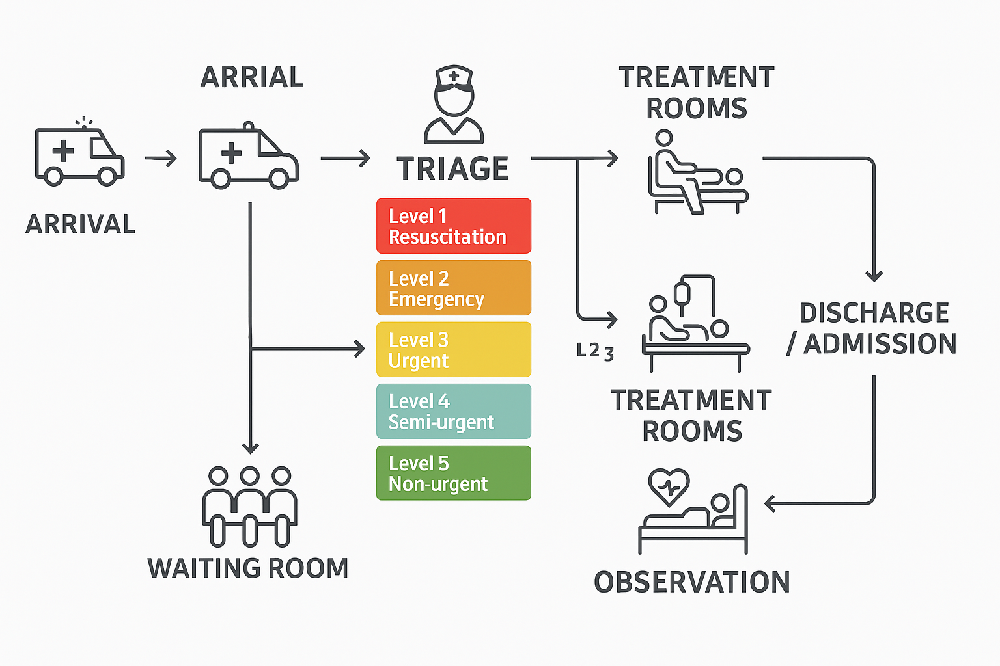
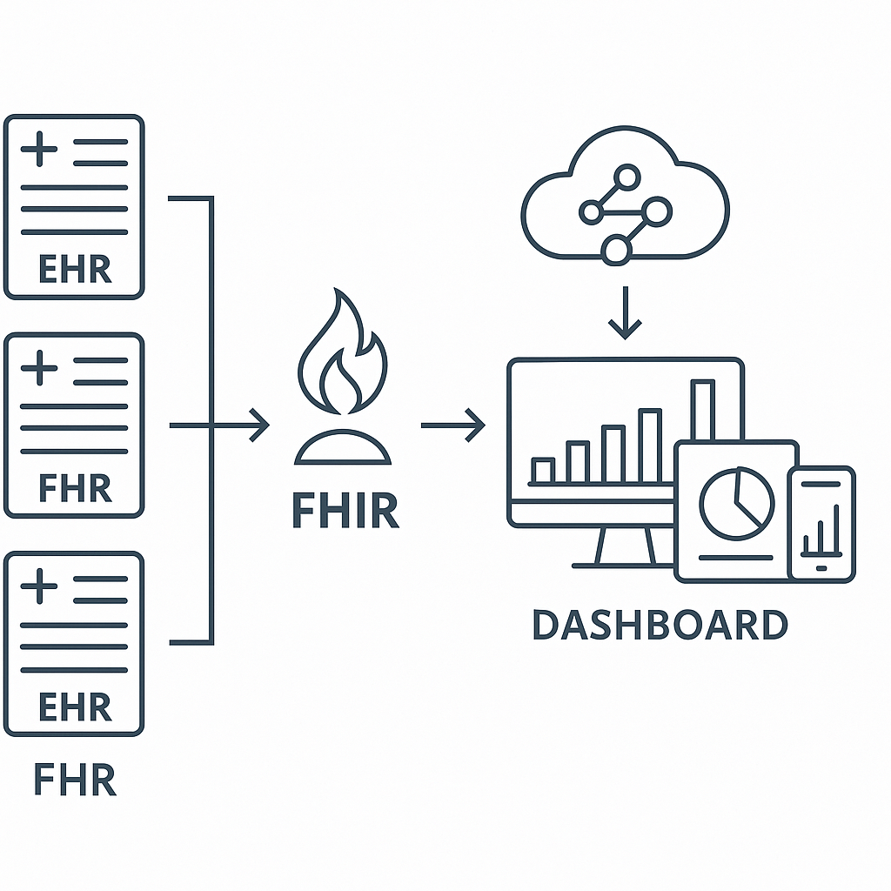

# 🏥 Hospital Analytics Dashboard | لوحة تحليلات المستشفى

<div align="center">


**A comprehensive, interactive hospital analytics dashboard with Power BI-inspired design and full Arabic language support**

**لوحة تحكم تحليلية شاملة وتفاعلية للمستشفيات بتصميم مستوحى من Power BI ودعم كامل للغة العربية**

</div>

## 📋 Table of Contents | جدول المحتويات

- [🌟 Features | الميزات](#-features--الميزات)
- [🎯 Key Performance Indicators | المؤشرات الرئيسية](#-key-performance-indicators--المؤشرات-الرئيسية)
- [📊 Interactive Charts | المخططات التفاعلية](#-interactive-charts--المخططات-التفاعلية)
- [🚀 Getting Started | البدء السريع](#-getting-started--البدء-السريع)
- [💻 Technology Stack | التقنيات المستخدمة](#-technology-stack--التقنيات-المستخدمة)
- [📱 Screenshots | لقطات الشاشة](#-screenshots--لقطات-الشاشة)
- [🔧 Installation | التثبيت](#-installation--التثبيت)
- [📈 Usage | الاستخدام](#-usage--الاستخدام)
- [🤝 Contributing | المساهمة](#-contributing--المساهمة)
- [📄 License | الترخيص](#-license--الترخيص)

## 🌟 Features | الميزات

### English
- **🎨 Power BI-Inspired Design**: Modern, professional interface matching Microsoft Power BI aesthetics
- **📊 Interactive Data Visualizations**: Real-time charts using Chart.js library
- **🌐 Full Arabic Language Support**: Complete RTL support with Arabic labels and tooltips
- **📱 Responsive Design**: Works seamlessly across desktop, tablet, and mobile devices
- **🏥 Clinical Quality Analytics**: Comprehensive healthcare quality metrics and KPIs
- **⚡ Real-time Updates**: Dynamic data updates with loading states and error handling
- **🎯 Multiple Dashboard Views**: Overview, Emergency, Quality, Operations, and Financial tabs
- **🔍 Advanced Analytics**: Patient flow analysis, length of stay metrics, satisfaction scores

### العربية
- **🎨 تصميم مستوحى من Power BI**: واجهة حديثة واحترافية تضاهي جماليات Microsoft Power BI
- **📊 تصورات بيانات تفاعلية**: مخططات فورية باستخدام مكتبة Chart.js
- **🌐 دعم كامل للغة العربية**: دعم شامل للاتجاه من اليمين لليسار مع تسميات وتلميحات عربية
- **📱 تصميم متجاوب**: يعمل بسلاسة عبر أجهزة سطح المكتب والأجهزة اللوحية والهواتف المحمولة
- **🏥 تحليلات الجودة السريرية**: مقاييس ومؤشرات شاملة لجودة الرعاية الصحية
- **⚡ تحديثات فورية**: تحديثات بيانات ديناميكية مع حالات التحميل ومعالجة الأخطاء
- **🎯 عروض متعددة للوحة التحكم**: علامات تبويب للنظرة العامة والطوارئ والجودة والعمليات والمالية
- **🔍 تحليلات متقدمة**: تحليل تدفق المرضى ومقاييس مدة الإقامة ودرجات الرضا

## 🎯 Key Performance Indicators | المؤشرات الرئيسية

### Healthcare Metrics | المقاييس الصحية
- **Patient Flow Analysis** | تحليل تدفق المرضى
- **Average Length of Stay** | متوسط مدة الإقامة
- **Patient Satisfaction Scores** | درجات رضا المرضى
- **HCAHPS Ratings** | تقييمات HCAHPS
- **Clinical Quality Measures** | مقاييس الجودة السريرية
- **Staff-to-Patient Ratios** | نسب الموظفين للمرضى

### Quality Indicators | مؤشرات الجودة
- **Infection Rates** | معدلات العدوى
- **Readmission Rates** | معدلات إعادة الدخول
- **Medication Errors** | أخطاء الأدوية
- **Patient Safety Metrics** | مقاييس سلامة المرضى
- **Mortality Rates** | معدلات الوفيات
- **Hand Hygiene Compliance** | امتثال النظافة

## 📊 Interactive Charts | المخططات التفاعلية

### 1. Daily Patient Flow Chart | مخطط تدفق المرضى اليومي
- **Type**: Line Chart | مخطط خطي
- **Data**: Last 30 days | آخر 30 يوم
- **Metrics**: Admissions, Discharges, Transfers | الدخولات، الخروج، التحويلات

### 2. Length of Stay Analysis | تحليل مدة الإقامة
- **Type**: Bar Chart | مخطط أعمدة
- **Comparison**: Current vs Benchmark vs Target | الحالي مقابل المعيار مقابل الهدف
- **Departments**: All hospital departments | جميع أقسام المستشفى

### 3. Patient Satisfaction by Department | رضا المرضى حسب القسم
- **Type**: Horizontal Bar Chart | مخطط أعمدة أفقي
- **Metrics**: Satisfaction, HCAHPS, National Average | الرضا، HCAHPS، المتوسط الوطني

### 4. Core Quality Measures | المقاييس الأساسية للجودة
- **Type**: Radar Chart | مخطط رادار
- **Indicators**: 6 key quality metrics | 6 مؤشرات جودة رئيسية

### 5. Staff-to-Patient Ratios | نسب الموظفين للمرضى
- **Type**: Bar Chart + Doughnut Chart | مخطط أعمدة + دائري
- **Analysis**: By department and shift | حسب القسم والوردية

## 💻 Technology Stack | التقنيات المستخدمة

- **Frontend**: HTML5, CSS3, JavaScript ES6+
- **Charts**: Chart.js 4.4.0
- **Fonts**: Google Fonts (Inter)
- **Icons**: Unicode Emojis
- **Responsive**: CSS Grid & Flexbox
- **Language**: Arabic (RTL) + English
- **Browser Support**: Modern browsers (Chrome, Firefox, Safari, Edge)

## 📱 Screenshots | لقطات الشاشة

### Dashboard Overview | نظرة عامة على لوحة التحكم


### Interactive Charts | المخططات التفاعلية


## 🚀 Getting Started | البدء السريع

### Quick Start | البدء السريع

1. **Clone the repository | استنساخ المستودع**
```bash
git clone https://github.com/YasserAlsousi/Data-Analisys-hospital-analytics.git
```

2. **Navigate to project directory | الانتقال إلى مجلد المشروع**
```bash
cd Data-Analisys-hospital-analytics
```

3. **Open in browser | فتح في المتصفح**
```bash
# Simply open index.html in your preferred browser
# ببساطة افتح index.html في متصفحك المفضل
```

### Live Demo | العرض المباشر
🌐 **[View Live Demo](https://yasseralsousi.github.io/Data-Analisys-hospital-analytics/)**

## 🔧 Installation | التثبيت

### Prerequisites | المتطلبات المسبقة
- Modern web browser | متصفح ويب حديث
- Internet connection (for Google Fonts and Chart.js CDN) | اتصال بالإنترنت

### Local Development | التطوير المحلي

1. **Download or clone the project | تحميل أو استنساخ المشروع**
2. **No build process required | لا حاجة لعملية بناء**
3. **Open `index.html` directly in browser | افتح `index.html` مباشرة في المتصفح**

### File Structure | هيكل الملفات
```
hospital-analytics-dashboard/
├── index.html              # Main HTML file | الملف الرئيسي
├── style.css              # Styles and themes | الأنماط والثيمات
├── app.js                 # JavaScript logic | منطق JavaScript
├── assets/                # Assets folder | مجلد الأصول
│   └── images/           # Screenshots | لقطات الشاشة
│       ├── 0001.png
│       └── 0002.png
└── README.md             # Documentation | التوثيق
```

## 📈 Usage | الاستخدام

### Dashboard Navigation | التنقل في لوحة التحكم

#### English
1. **Overview Tab**: Main dashboard with key KPIs and patient flow chart
2. **Emergency Tab**: Emergency department metrics and wait times
3. **Clinical Quality Tab**: Quality measures, satisfaction scores, and safety metrics
4. **Operations Tab**: Operational efficiency and staff ratios
5. **Financial Tab**: Financial performance and cost analysis

#### العربية
1. **علامة تبويب النظرة العامة**: لوحة التحكم الرئيسية مع المؤشرات الرئيسية ومخطط تدفق المرضى
2. **علامة تبويب الطوارئ**: مقاييس قسم الطوارئ وأوقات الانتظار
3. **علامة تبويب الجودة السريرية**: مقاييس الجودة ودرجات الرضا ومقاييس السلامة
4. **علامة تبويب العمليات**: الكفاءة التشغيلية ونسب الموظفين
5. **علامة تبويب المالية**: الأداء المالي وتحليل التكاليف

### Interactive Features | الميزات التفاعلية

- **Hover Effects**: Hover over charts for detailed tooltips | مرر فوق المخططات للحصول على تلميحات مفصلة
- **Responsive Design**: Automatically adapts to screen size | يتكيف تلقائياً مع حجم الشاشة
- **Real-time Updates**: Data refreshes automatically | تحديث البيانات تلقائياً
- **Error Handling**: Graceful error messages and retry options | رسائل خطأ واضحة وخيارات إعادة المحاولة

## 🎨 Customization | التخصيص

### Color Scheme | نظام الألوان
The dashboard uses a Power BI-inspired color palette:
- **Primary**: #0078D4 (Power BI Blue)
- **Secondary**: #00BCF2 (Light Blue)
- **Accent**: #40E0D0 (Turquoise)
- **Success**: #34C759 (Green)
- **Warning**: #FF9500 (Orange)
- **Error**: #FF3B30 (Red)

### Font Configuration | إعداد الخطوط
- **Primary Font**: Inter (Google Fonts)
- **Fallback**: Arial, sans-serif
- **Arabic Support**: Full RTL text direction support

## 🔍 Data Sources | مصادر البيانات

### Simulated Data | البيانات المحاكية
The dashboard currently uses simulated healthcare data for demonstration purposes:

- **Patient Flow**: 30 days of admission/discharge/transfer data
- **Quality Metrics**: Realistic healthcare quality indicators
- **Satisfaction Scores**: Department-wise patient satisfaction ratings
- **Staff Ratios**: Nursing staff to patient ratios by department and shift

### Real Data Integration | تكامل البيانات الحقيقية
To integrate with real hospital data:

1. **API Integration**: Modify `app.js` to fetch data from your hospital's API
2. **Database Connection**: Connect to your hospital information system
3. **Data Format**: Ensure data matches the expected JSON structure
4. **Update Frequency**: Configure automatic data refresh intervals

## 🛠️ Development | التطوير

### Code Structure | هيكل الكود

#### HTML Structure | هيكل HTML
- Semantic HTML5 elements
- Accessible navigation
- Canvas elements for charts
- RTL language support

#### CSS Architecture | معمارية CSS
- CSS Custom Properties (Variables)
- Mobile-first responsive design
- Power BI-inspired styling
- Arabic typography support

#### JavaScript Organization | تنظيم JavaScript
- Modular function structure
- Chart.js integration
- Error handling and loading states
- Data generation and management

### Browser Compatibility | توافق المتصفحات

| Browser | Version | Support |
|---------|---------|---------|
| Chrome  | 80+     | ✅ Full |
| Firefox | 75+     | ✅ Full |
| Safari  | 13+     | ✅ Full |
| Edge    | 80+     | ✅ Full |

## 🧪 Testing | الاختبار

### Manual Testing | الاختبار اليدوي
1. **Cross-browser testing** | اختبار عبر المتصفحات
2. **Responsive design testing** | اختبار التصميم المتجاوب
3. **Chart functionality testing** | اختبار وظائف المخططات
4. **Arabic language testing** | اختبار اللغة العربية

### Debug Functions | دوال التشخيص
The dashboard includes built-in debug functions accessible via browser console:

```javascript
// Test patient flow chart
testPatientFlowChart()

// Reinitialize charts manually
reinitializePatientFlowChart()

// Generate test data
generateDailyPatientFlowData()
```

## 🤝 Contributing | المساهمة

### English
We welcome contributions! Please follow these steps:

1. Fork the repository
2. Create a feature branch (`git checkout -b feature/AmazingFeature`)
3. Commit your changes (`git commit -m 'Add some AmazingFeature'`)
4. Push to the branch (`git push origin feature/AmazingFeature`)
5. Open a Pull Request

### العربية
نرحب بالمساهمات! يرجى اتباع هذه الخطوات:

1. انسخ المستودع (Fork)
2. أنشئ فرع ميزة (`git checkout -b feature/AmazingFeature`)
3. احفظ تغييراتك (`git commit -m 'Add some AmazingFeature'`)
4. ادفع إلى الفرع (`git push origin feature/AmazingFeature`)
5. افتح طلب سحب (Pull Request)

## 📞 Contact | التواصل

**Yasser Alsousi** | **ياسر الصوصي**
- GitHub: [@YasserAlsousi](https://github.com/YasserAlsousi)
- Email: yasserprogramer@hotmail.com

## 📄 License | الترخيص

This project is licensed under the MIT License - see the [LICENSE](LICENSE) file for details.

هذا المشروع مرخص تحت رخصة MIT - راجع ملف [LICENSE](LICENSE) للتفاصيل.

---

<div align="center">

**Made with ❤️ for Healthcare Analytics | صُنع بـ ❤️ لتحليلات الرعاية الصحية**

⭐ **If you found this project helpful, please give it a star!** | **إذا وجدت هذا المشروع مفيداً، يرجى إعطاؤه نجمة!** ⭐

</div>
